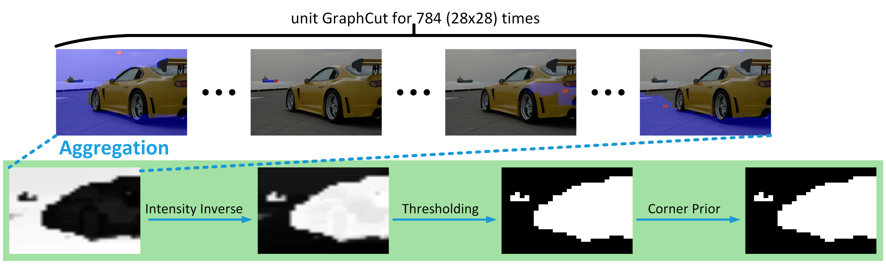

# UnionCut

This repository provides the official implementation of methods (i.e. UnionCut and UnionSeg) proposed in the paper titled "Ensemble Foreground Management for Unsupervised Object Discovery" (ICCV2025).

<p align="center">  </p>

_"UnionCut takes an image as input with features extracted from a frozen DINO, and applies Unit Voters (UVs) with each using one patch as its seed. Red rectangles refer to the seed patch, and blue areas indicate the UV\textquotesingle s output of the region similar to its seed patch. Aggregating all UV's outputs yields a heat map of the background, which is then inverted, thresholded, and rectified with a corner prior to produce a binary mask of the image's foreground union."_

## Install
This repository provides the implementation of UnionCut and UnionSeg, showing examples of combining them with existing unsupervised object discovery (UOD) algorithms (e.g. [TokenCut](https://ieeexplore.ieee.org/document/10224285?denied=) and [MaskCut](https://people.eecs.berkeley.edu/~xdwang/projects/CutLER/)). Clone this repository first and install other dependencies (e.g. CuPy, Numpy, torch, and h5py), whose details can be seen in [requirements.txt](/requirements.txt).
```
git clone https://github.com/YFaris/UnionCut.git
```
You may also need to install [Detectron2](https://github.com/facebookresearch/detectron2) if you would like to try the functions related to [CutLER](https://github.com/facebookresearch/CutLER/tree/main).

## Demo
<p align="center">  </p>

### UnionCut demo
The core function of UnionCut is implemented in [/UnionCut/DINOinference.py](/UnionCut/DINOinference.py). You can run the demo with the following commands:
```
cd ./UnionCut
python3 DINOinference.py --img-folder [the path of your folder containing test images]
```
This script will create three windows for visualization: the original image, its foreground union given by UnionCut, and the object discovery result by TokenCut+UnionCut. The user can click '_q_' to quit the demo, '_s_' to save the result to _/UnionCut/demo/_, and any other key to the next image.

We also provide a Cython version of UnionCut, which runs 2 times faster than the Python one. It can be run by the command below:
```
python3 DINOinferenceCython.py --img-folder [the path of your folder containing test images]
```

### UnionSeg demo
UnionSeg is trained as a surrogate model of UnionCut, with UnionCut's output on [DUTS-TR](http://saliencydetection.net/duts/) dataset (10,553 images in the training part). Download the dataset first and organize the dataset in your local directory similar to the following style: 
```
Your parent folder for all datasets/
  DUTS/
    DUTS-TR/
      DUTS-TR-Image/*.jpg ...
      DUTS-TR-Mask/*.png ...
    DUTS-TE/
      DUTS-TE-Image/*.jpg ...
      DUTS-TE-Mask/*.png ...
```
We have provided a well-trained UnionSeg, which can be found at _/UnionSeg/module/decoder_weights_niter600.pt_. Our training codes of UnionSeg are mostly borrowed from [FOUND](https://github.com/valeoai/FOUND/tree/main). If you would like to train your own UnionSeg, you can try the following procedure:
1. collect and save UnionCut's output
```
cd ./tools/PseudoMaskGeneration/DUTS-TR
mkdir ./h5
python3 MultiProcess_TokenUnionCut_DUTS_TR_pseudo_mask_generation.py --dataset [the path of your parent folder for all datasets] --process-num [an int value to assign the number of subprocesses]
```
You can choose an appropriate number of subprocesses based on your computational resources by setting _--process-num_ to accelerate UnionCut's execution throughout the whole dataset in parallel. The step may take a few hours. After it is done, an h5 file containing the information of images with corresponding UnionCut's output can be seen in the _h5_ folder created just now.

2. train your UnionSeg

Now you can train your own UnionSeg with the following commands:
```
cd ./UnionSeg
python3 train.py --img-folder [the path of your parent folder for all datasets] --h5-path [the path of the h5 file pregenerated]
```
The training takes only a few minutes. After training, your UnionSeg will be saved at _/UnionSeg/module/decoder_weights_niter600.pt_

Now you can try the demo of UnionSeg:
```
cd ./UnionSeg
python3 inference.py --img-folder [the path of your folder containing test images] --uod-method [MaskCur or TokenCut] --use-cupy [True or False] --N [an int value for MaskCut maximum discovery times per image]
```
Similar to the UnionCut demo, you can see the visualization of the input image, foreground union given by UnionSeg, and discovery result by TokenCut/MaskCut+UnionSeg. You can press '_q_' to quit the demo, '_s_' to save the result to _/UnionSeg/demo/_, and any other key to the next image.

## CutLER+UnionSeg
We use the cookbook of [CutLER](https://github.com/facebookresearch/CutLER/tree/main) with our UnionSeg to train a class-agnostic instance segmentation model. For the installation of CutLER we refer you to the original [CutLER's repository](https://github.com/facebookresearch/CutLER/tree/main). After setting up the official CutLER's implementation, you need to follow the instructions below to combine our UnionSeg with CutLER:
1. copy our UnionSeg package at _/CutLER/third_party/UnionSeg_ under CutLER's corresponding directory: _CutLER/third_party/_
2. replace CutLER's official implementation of MaskCut (_CutLER/maskcut/maskcut.py_) with our MaskCut+UnionSeg (_UnionCut/CutLER/MaskCut/maskcut.py_)
3. replace CutLER's training setting configuration files (_CutLER/cutler/model_zoo/configs/CutLER-ImageNet/cascade_mask_rcnn_R_50_FPN_self_train.yaml_ and _CutLER/cutler/model_zoo/configs/CutLER-ImageNet
/cascade_mask_rcnn_R_50_FPN.yaml_) with our version, i.e _/CutLER/configs/cascade_mask_rcnn_R_50_FPN_self_train.yaml_ and _/CutLER/configs/cascade_mask_rcnn_R_50_FPN.yaml_.

Now you can follow the instructions of CutLER to generate pseudo annotations for [ImageNet](https://www.image-net.org/) (you may need to prepare the dataset in advance following the instructions of CutLER). Here are some examples:
> 1. Generate pseudo annotations for ImageNet with our MaskCut+UnionSeg
>> ```
>> cd maskcut
>> python maskcut.py --vit-arch base --patch-size 8 --tau 0.15 --fixed_size 480 --N 3 --num-folder-per-job 1000 --job-index 0 --dataset-path /path/to/dataset/traindir --out-dir /path/to/save/annotations --use-cupy True --realN 5
>> ```
Note that --realN is the argument for changing the maximum discovery times. The argument --N cannot directly change the maximum discovery times of our MaskCut+UnionSeg, as it does in CutLER's original implementation. It only affects the filename of generated annotation files. We recommend always setting --N to 3 to avoid errors and changing --realN to adjust discovery times.

If you run the command above with multiple processes for acceleration, you also need to merge the output of each process following official CutLER's instructions:
> 2. Merge results
>> ```o assign the number of subprocesses]
>> python merge_jsons.py --base-dir /path/to/save/annotations --num-folder-per-job 2 --fixed-size 480 --tau 0.15 --N 3 --save-path imagenet_train_fixsize480_tau0.15_N3.json
>> ```

Now you can use CutLER's training code to train a class-agnostic [Cascade Mask-RCNN](https://openaccess.thecvf.com/content_cvpr_2018/papers/Cai_Cascade_R-CNN_Delving_CVPR_2018_paper.pdf):
> 3. first round warm-up training
>> ```
>> cd cutler
>> export DETECTRON2_DATASETS=/path/to/DETECTRON2_DATASETS/
>> python train_net.py --num-gpus 8 --config-file model_zoo/configs/CutLER-ImageNet/cascade_mask_rcnn_R_50_FPN.yaml
>> ```
You should stop training at 10,000 iterations to avoid underfitting since we apply a big weight decay in the first round warm-up training.

Then, you shall use the trained model to update pseudo-annotations of each image in the dataset:
> 4. update annotations
>> ```
>> python train_net.py --num-gpus 8 \
>> --config-file model_zoo/configs/CutLER-ImageNet/cascade_mask_rcnn_R_50_FPN.yaml \
>> --test-dataset imagenet_train \
>> --eval-only TEST.DETECTIONS_PER_IMAGE 30 \
>> MODEL.WEIGHTS output/model_0009999.pth \ # load previous stage/round checkpoints
>> OUTPUT_DIR output/ # path to save model predictions
>>
>> python tools/get_self_training_ann.py \
>> --new-pred output/inference/coco_instances_results.json \ # load model predictions
>> --prev-ann DETECTRON2_DATASETS/imagenet/annotations/imagenet_train_fixsize480_tau0.15_N3.json \ # path to the old annotation file.
>> --save-path DETECTRON2_DATASETS/imagenet/annotations/cutler_imagenet1k_train_r1.json \ # path to save a new annotation file.
>> --threshold 0.7
>> ```

After that, the model should be further trained for 60,000 iterations to obtain the final model:
> 5. self-training
>> ```
>> python train_net.py --num-gpus 8 \
>> --config-file model_zoo/configs/CutLER-ImageNet/cascade_mask_rcnn_R_50_FPN_self_train.yaml \
>> --train-dataset imagenet_train_r1 \
>> MODEL.WEIGHTS output/model_0009999.pth \ # load previous stage/round checkpoints
>> OUTPUT_DIR output/self-train-r1/ # path to save checkpoints
>> ```
Note that the training should be stopped at 60,000 iterations to avoid over-fitting.

## Evaluation
The evaluation of UOD methods on single object discovery and saliency detection follows the pattern below:
1. collecting the output of UOD methods and saving to h5 files;
2. running the metrics script with the h5 file and ground truth file as the input for evaluation

In terms of the evaluation of class-agnostic instance segmentation, please follow the instructions in [CutLER's official guidelines]((https://github.com/facebookresearch/CutLER/tree/main)). Here we only demo the evaluation of the former two tasks.

### Single Object Discovery
#### Benchmark Preparation
Please download the benchmarks ([VOC07](http://host.robots.ox.ac.uk/pascal/VOC/voc2007/index.html), [VOC12](http://host.robots.ox.ac.uk/pascal/VOC/voc2012/index.html), and [COCO20K](https://cocodataset.org/#download)), within which COCO20K is a subset of COCO2014. The images list of COCO20K can be found [here](https://github.com/valeoai/LOST/blob/master/datasets/coco_20k_filenames.txt). After downloading all benchmarks, please organize them according to the structure below:
```
Your parent folder for all datasets/
  VOC/
    VOC2007/VOCdevkit/VOC2007/
      JPEGImages/*.jpg ...
      ImageSets
      Annotations/*.xml ...
      SegmentationClass/*.png ...
      SegmentationObject/*.png ...
    /VOC2012/VOCtrainval_11-May-2012/VOCdevkit/VOC2012/
      JPEGImages/*.jpg ...
      ImageSets
      Annotations/*.xml ...
      SegmentationClass/*.png ...
      SegmentationObject/*.png ...
  coco/
    train2014/*.jpg ...
    annotations/instances_train2014.json
```
#### Discovery Result Collection
In _/tools/PseudoMaskGeneration_, you can find seven subfolders named corresponding to the dataset. In each subfolder, there are two scripts, one is for TokenCut+UnionCut (_tools/PseudoMaskGeneration/{DatasetName}/MultiProcess_TokenUnionCut\_{DatasetName}\_pseudo_mask_generation_) and the other one is for TokenCut+UnionSeg (_tools/PseudoMaskGeneration/{DatasetName}/MultiProcess_TokenUnionSeg\_{DatasetName}\_pseudo_mask_generation_). Take TokenCut+UnionCut and VOC07 as an example, to obtain the object discovery result, you can run the following command:
```
cd ./tools/PseudoMaskGeneration/VOC07
mkdir ./h5
python3 MultiProcess_TokenUnionCut_VOC2007_pseudo_mask_generation.py --dataset [the path of your parent folder for all datasets] --process-num [an int value to assign the number of subprocesses]
```
When it is done, you will find an h5 file created under _./h5_, containing the UOD result of TokenCut+UnionCut on VOC07.

You may also be interested in collecting the output of our CutLER+UnionSeg. You can do this by running _/tools/CascadeMaskRCNN/h5_generation.py_. Before running, you need to modify three parameters in the code:
```
model_path = "path of the trained model's checkpoint"
dataset_name = "VOC07"  # name of the dataset, choices from ["VOC07", "VOC12", "DUTS-TE", "ECSSD", "DUTS-OMRON"]
dataset_path = "path of the parent folder for all datasets/"
```
To evaluate the single object discovery performance of the method on the selected benchmark with CorLoc as the metrics, you can run the following commands:
```
cd ./Evaluation
python3 CorLoc.py --h5-path [path of the pre-generated h5 file] --uod-method ["TokenGraphCut", "UnionSeg", "CutLER"] --dataset [name of the dataset, "VOC" or "COCO20K"] --gt-path [path of the ground truth folder/file]
```
As for the choice of --uod-method, "TokenGraphCut", "UnionSeg", and "CutLER" are for TokenCut+UnionCut, TokenCut+UnionSeg, and CutLER+UnionSeg, respectively.

### Saliency Detection
#### Benchmark Preparation
Please download the benchmarks: [DUTS-TE]([http://host.robots.ox.ac.uk/pascal/VOC/voc2007/index.html](http://saliencydetection.net/duts/)), [DUTS-OMRON](http://saliencydetection.net/dut-omron/), and [ECSSD](https://www.cse.cuhk.edu.hk/leojia/projects/hsaliency/dataset.html). After downloading all benchmarks, please organize them according to the structure below:
```
Your parent folder for all datasets/
  DUTS/
    DUTS-TR/
      DUTS-TR-Image/*.jpg ...
      DUTS-TR-Mask/*.png ...
    DUTS-TE/
      DUTS-TE-Image/*.jpg ...
      DUTS-TE-Mask/*.png ...
  DUTS-OMRON/
    DUT-OMRON-image/DUT-OMRON-image/*.jpg ...
    DUT-OMRON-gt-pixelwise.zip/pixelwiseGT-new-PNG/*.png ...
  ECSSD/
    images/*.jpg ...
    ground_truth_mask/*.png ...
```
Similar to the previous section's pattern, the evaluation contains two steps: 1) collecting algorithm output into h5 files and 2) doing the evaluation. The procedure of the first step is the same as the previous section. As for evaluation, you can do it with the following commands:

```
cd ./Evaluation
python3 saliency_metrics.py --h5-path [path of the pre-generated h5 file] --uod-method ["TokenGraphCut", "UnionSeg", "CutLER"] --dataset [name of the dataset, "ECSSD", "DUTS", or "DUTS-OMRON"] --gt-path [path of the ground truth folder]
```
